# Diagram Catalog

Each diagram includes a title, components, flow explanation, Mermaid code, and target location.

## Alibaba Cloud High-Level Architecture

Components: users, CDN, SLB, ECS/ACK/Function Compute, OSS, RDS, SLS, CloudMonitor, RAM.

Flow: users enter through edge and load-balancing services, workloads process requests, data services store state, and observability/security services govern the platform.

Place in repo: `assets/diagrams/alibaba-cloud-high-level-architecture.mmd`

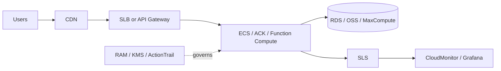

## VPC With Public And Private Subnets

Components: VPC, public vSwitch, private vSwitch, SLB, NAT Gateway, ECS, RDS.

Flow: users access public SLB, private ECS connects to RDS, and NAT supports outbound updates.

Place in repo: `assets/diagrams/vpc-public-private-subnets.mmd`

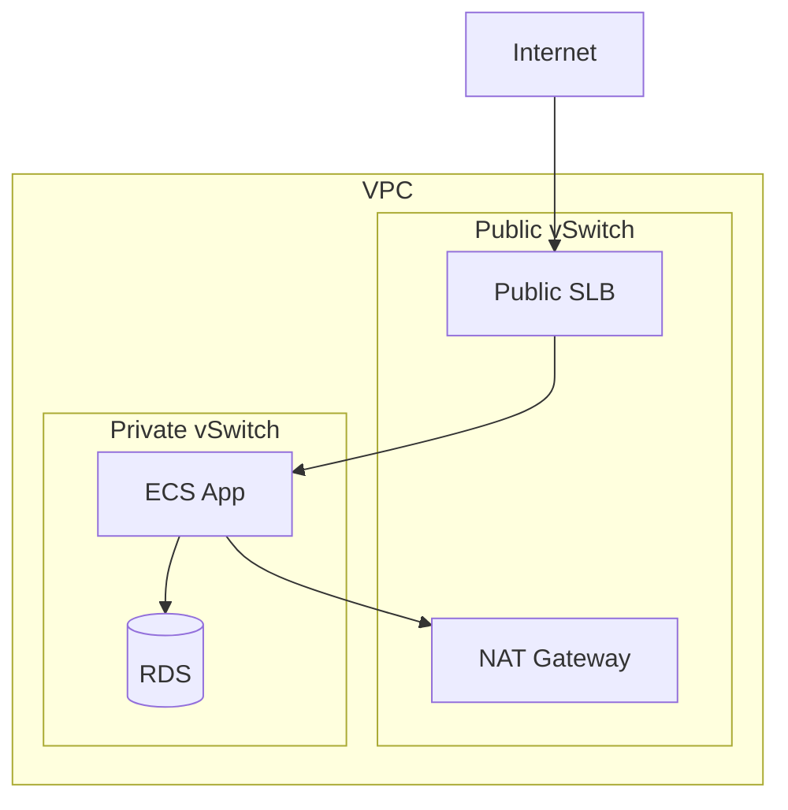

## Secure Three-Tier Web Application

Place in repo: `assets/diagrams/secure-three-tier-web-app.mmd`

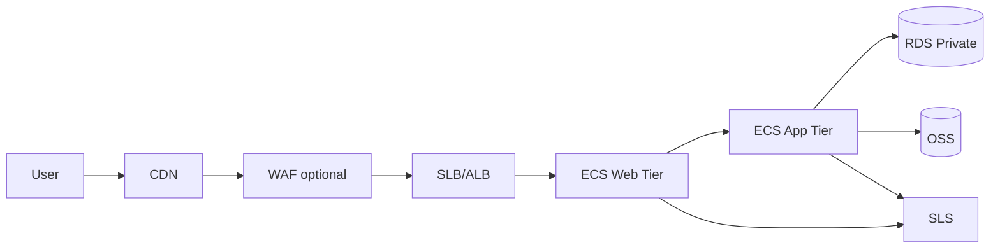

## OSS Static Website With CDN

Place in repo: `assets/diagrams/oss-static-website-cdn.mmd`

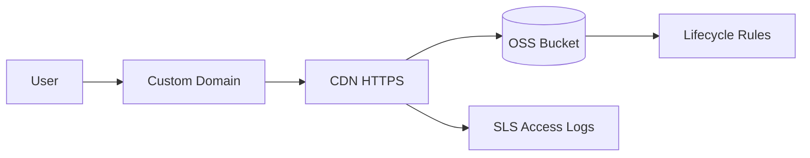

## ECS + SLB + RDS Architecture

Place in repo: `assets/diagrams/ecs-slb-rds.mmd`

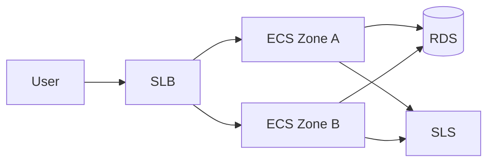

## Kubernetes App On ACK

Place in repo: `assets/diagrams/ack-kubernetes-app.mmd`

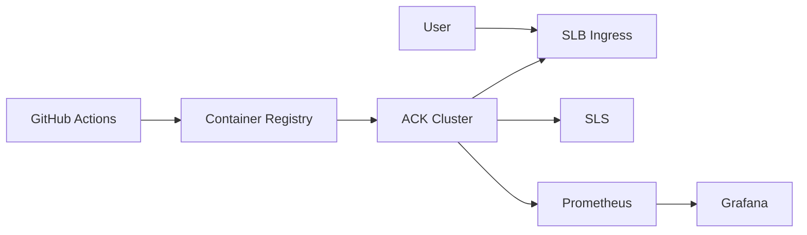

## Serverless API

Place in repo: `assets/diagrams/serverless-api.mmd`

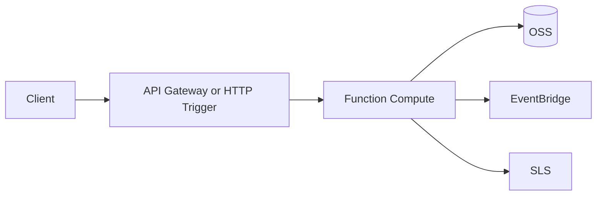

## Data Lake On OSS

Place in repo: `assets/diagrams/data-lake-on-oss.mmd`

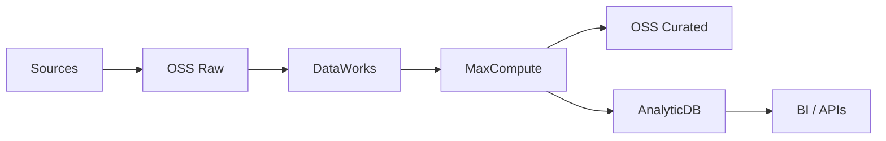

## Real-Time Streaming Pipeline

Place in repo: `assets/diagrams/real-time-streaming-pipeline.mmd`

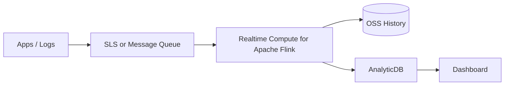

## AI-Ready Data Platform

Place in repo: `assets/diagrams/ai-ready-data-platform.mmd`

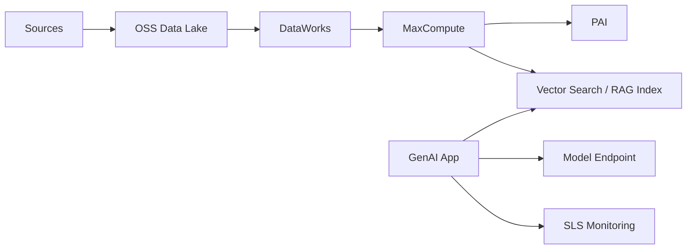

## Enterprise Landing Zone

Place in repo: `assets/diagrams/enterprise-landing-zone.mmd`

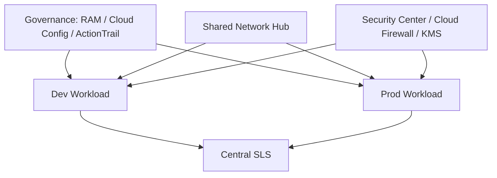

## Multi-Region DR Design

Place in repo: `assets/diagrams/multi-region-dr-design.mmd`

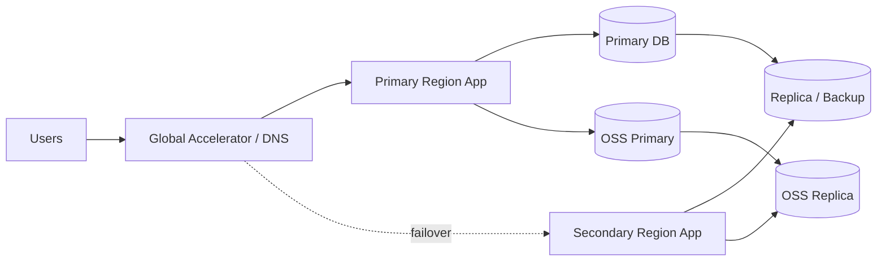

## Hybrid Cloud Connectivity

Place in repo: `assets/diagrams/hybrid-cloud-connectivity.mmd`

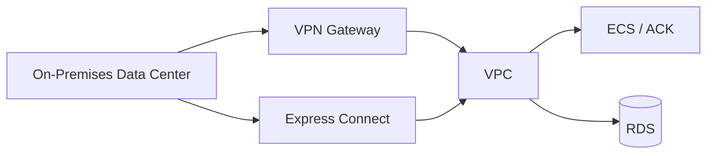

## Security Monitoring Architecture

Place in repo: `assets/diagrams/security-monitoring-architecture.mmd`

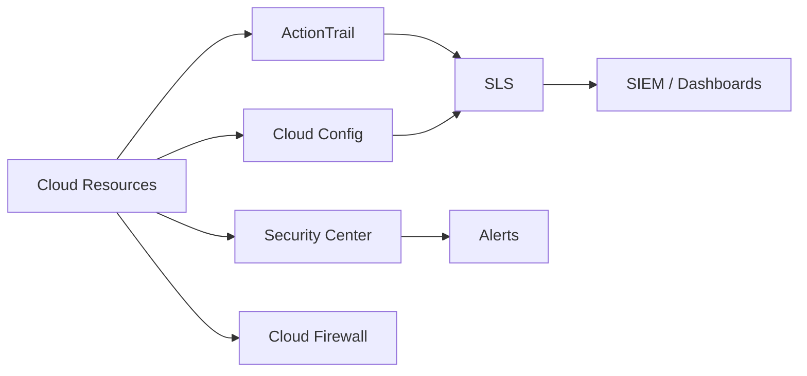

## Cost Governance Architecture

Place in repo: `assets/diagrams/cost-governance-architecture.mmd`

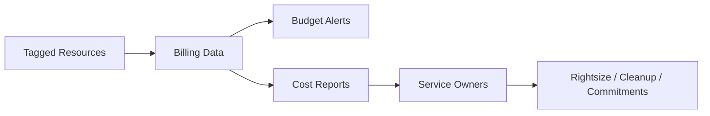
