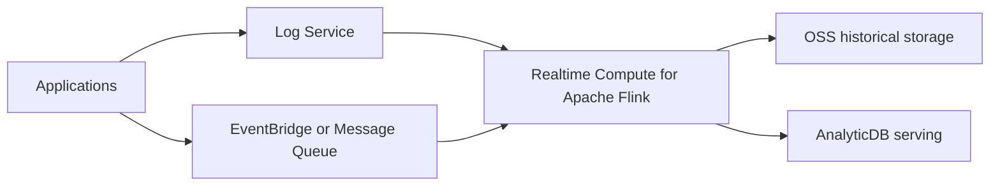

# Real Time Streaming Pipeline

## Purpose

This diagram provides a practical Alibaba Cloud architecture view for learning, implementation planning, and interview explanation.

## Components

- Alibaba Cloud services shown in the diagram.
- Identity, networking, data, observability, and cost controls where relevant.
- Workload or user flow.

## Flow Explanation

Read the diagram from left to right or top to bottom. Explain who calls what, where data lives, which services are private or public, and how the design is monitored and secured.

## Mermaid Diagram

## Where This Diagram Is Used

- Learning path README files
- Labs
- Projects
- Architecture interviews
